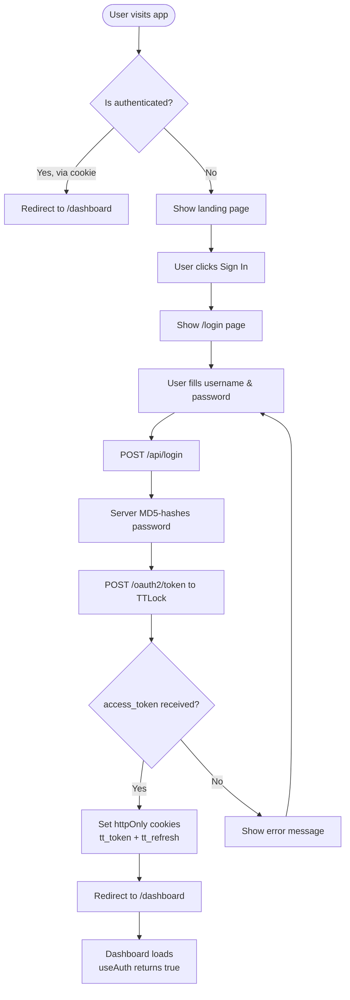
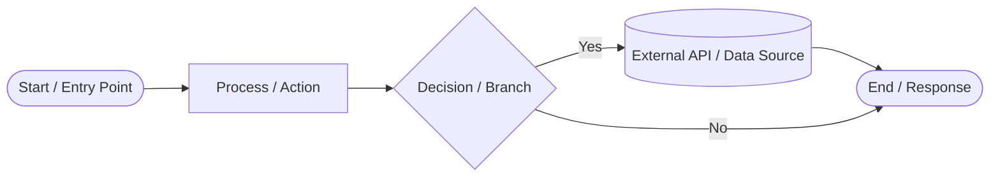

# Flowchart

## 1. Authentication Flow



---

## 2. Dashboard & Lock Management Flow

```mermaid
flowchart TD
    DASH[/dashboard/ loads] --> FETCH_LOCKS[useSWR: GET /api/locks]
    FETCH_LOCKS --> FETCH_GW[useSWR: GET /api/gateways]
    FETCH_LOCKS --> RENDER[Render lock cards + summary]
    FETCH_GW --> RENDER

    RENDER --> USER_ACTION{User action?}

    USER_ACTION -->|Click Unlock| UNLOCK[POST /api/locks<br/>{lockId, action: unlock}]
    USER_ACTION -->|Click Lock| LOCK[POST /api/locks<br/>{lockId, action: lock}]
    USER_ACTION -->|Click lock card| NAV_DETAIL[Navigate to /locks/{lockId}]

    UNLOCK --> TTL_UNLOCK[TTLock: POST /v3/lock/unlock]
    LOCK --> TTL_LOCK[TTLock: POST /v3/lock/lock]
    TTL_UNLOCK --> MUTATE[mutate() refresh list]
    TTL_LOCK --> MUTATE

    NAV_DETAIL --> LOCK_DETAIL[Lock Detail Page]
```

---

## 3. Lock Detail Page Flow

```mermaid
flowchart TD
    PAGE[/locks/{id} loads] --> PARAMS[Read lockId from URL params]
    PARAMS --> AUTH_GATE{useAuth: authenticated?}
    AUTH_GATE -->|No| LOGIN_REDIR[Redirect to /login]
    AUTH_GATE -->|Yes| SWR_BATCH[SWR fires 8 parallel requests]

    SWR_BATCH --> D1[GET /api/locks/{id}]
    SWR_BATCH --> D2[GET /api/passcodes?lockId=]
    SWR_BATCH --> D3[GET /api/ic-cards?lockId=]
    SWR_BATCH --> D4[GET /api/fingerprints?lockId=]
    SWR_BATCH --> D5[GET /api/records?lockId=]
    SWR_BATCH --> D6[GET /api/gateways]
    SWR_BATCH --> D7[GET /api/locks/config?lockId=]
    SWR_BATCH --> D8[GET /api/locks/door-sensor?lockId=]

    D1 --> RENDER[Render lock header<br/>name, battery, firmware, MAC]
    D2 --> RENDER_PASS[Render passcodes list]
    D3 --> RENDER_IC[Render IC cards list]
    D4 --> RENDER_FP[Render fingerprints list]
    D5 --> RENDER_REC[Render unlock records]
    D6 --> RENDER_GW[Render gateways]
    D7 --> RENDER_CONF[Render lock config]
    D8 --> RENDER_DOOR[Render door sensor state<br/>polls every 30s]

    RENDER_PASS --> PASS_ACTION{Passcode action?}
    PASS_ACTION -->|Add| ADD_PASS_FORM[Show form]
    ADD_PASS_FORM --> ADD_PASS[POST /api/passcodes<br/>{action: add, ...}]
    ADD_PASS --> REFRESH_PASS[refreshPass() mutate]
    PASS_ACTION -->|Delete| DEL_PASS[POST /api/passcodes<br/>{action: delete, passcodeId}]
    DEL_PASS --> REFRESH_PASS

    RENDER_IC --> IC_ACTION{IC card action?}
    IC_ACTION -->|Add| ADD_IC_FORM[Show form]
    ADD_IC_FORM --> ADD_IC[POST /api/ic-cards<br/>{action: add, ...}]
    ADD_IC --> REFRESH_IC[refreshIc() mutate]
    IC_ACTION -->|Delete| DEL_IC[POST /api/ic-cards<br/>{action: delete, cardId}]
    DEL_IC --> REFRESH_IC

    RENDER_FP --> FP_ACTION{Fingerprint action?}
    FP_ACTION -->|Add| ADD_FP_FORM[Show form]
    ADD_FP_FORM --> ADD_FP[POST /api/fingerprints<br/>{action: add, ...}]
    ADD_FP --> REFRESH_FP[refreshFp() mutate]
    FP_ACTION -->|Delete| DEL_FP[POST /api/fingerprints<br/>{action: delete, fingerprintId}]
    DEL_FP --> REFRESH_FP

    RENDER --> UPGRADE_BTN[Check Upgrade button]
    UPGRADE_BTN --> CHECK[POST /api/locks/upgrade<br/>{action: check}]
    CHECK --> SHOW_UPGRADE[Display firmware status]
```

---

## 4. eKey Management Flow

```mermaid
flowchart TD
    KEYS[/keys/ loads] --> FETCH_KEYS[useSWR: GET /api/keys]
    FETCH_KEYS --> RENDER_KEYS[Render key list<br/>with validity, type, remote status]

    RENDER_KEYS --> KEY_ACTION{Key action?}

    KEY_ACTION -->|Share| SHOW_FORM[Show Share Key form]
    SHOW_FORM --> FILL_FORM[Fill lockId, recipient, name]
    FILL_FORM --> SEND_KEY[POST /api/keys<br/>{action: send, ...}]
    SEND_KEY --> TTL_SEND[TTLock: POST /v3/key/send]
    TTL_SEND --> REFRESH_KEYS[mutate()]

    KEY_ACTION -->|Freeze| FREEZE[POST /api/keys<br/>{action: freeze, keyId}]
    FREEZE --> TTL_FREEZE[TTLock: POST /v3/key/freeze]
    TTL_FREEZE --> REFRESH_KEYS

    KEY_ACTION -->|Unfreeze| UNFREEZE[POST /api/keys<br/>{action: unfreeze, keyId}]
    UNFREEZE --> TTL_UNFREEZE[TTLock: POST /v3/key/unfreeze]
    TTL_UNFREEZE --> REFRESH_KEYS

    KEY_ACTION -->|Delete| DEL_KEY[POST /api/keys<br/>{action: delete, keyId}]
    DEL_KEY --> TTL_DEL[TTLock: POST /v3/key/delete]
    TTL_DEL --> REFRESH_KEYS
```

---

## 5. API Route Handler Pattern

```mermaid
flowchart TD
    REQ[Incoming HTTP Request] --> COOKIE{Has tt_token<br/>cookie?}
    COOKIE -->|No| 401[Return 401 Not Authenticated]
    COOKIE -->|Yes| READ_PARAMS[Parse request params/body]

    READ_PARAMS --> VALID{Valid params?}
    VALID -->|No| 400[Return 400 Bad Request]
    VALID -->|Yes| IMPORT[Dynamic import of<br/>ttlock function]

    IMPORT --> TTL_CALL[Call TTLock API<br/>with accessToken]

    TTL_CALL --> ERR{TTLock returned<br/>errcode != 0?}
    ERR -->|Yes| 502[Return 502 with<br/>TTLock error message]
    ERR -->|No| OK[Return 200<br/>{ok: true, data}]
```

---

## 6. Webhook Flow

```mermaid
flowchart TD
    TTH[TTLock sends POST to<br/>/api/webhook] --> PARSE[Parse JSON body]
    PARSE --> EXTRACT[Extract: lockId, recordId,<br/>unlockTime, unlockType, keyId, success]
    EXTRACT --> SIGN{TTLOCK_WEBHOOK_SECRET<br/>configured?}
    SIGN -->|Yes| VERIFY{Signature matches<br/>x-ttlock-signature?}
    VERIFY -->|No| 403[Return 403 Invalid signature]
    VERIFY -->|Yes| LOG[Log event to console]
    SIGN -->|No| LOG
    LOG --> TODO[Future: Save to DB<br/>Broadcast via SSE]
    TODO --> 200[Return {errcode: 0, errmsg: ok}]
```

---

## Legend


