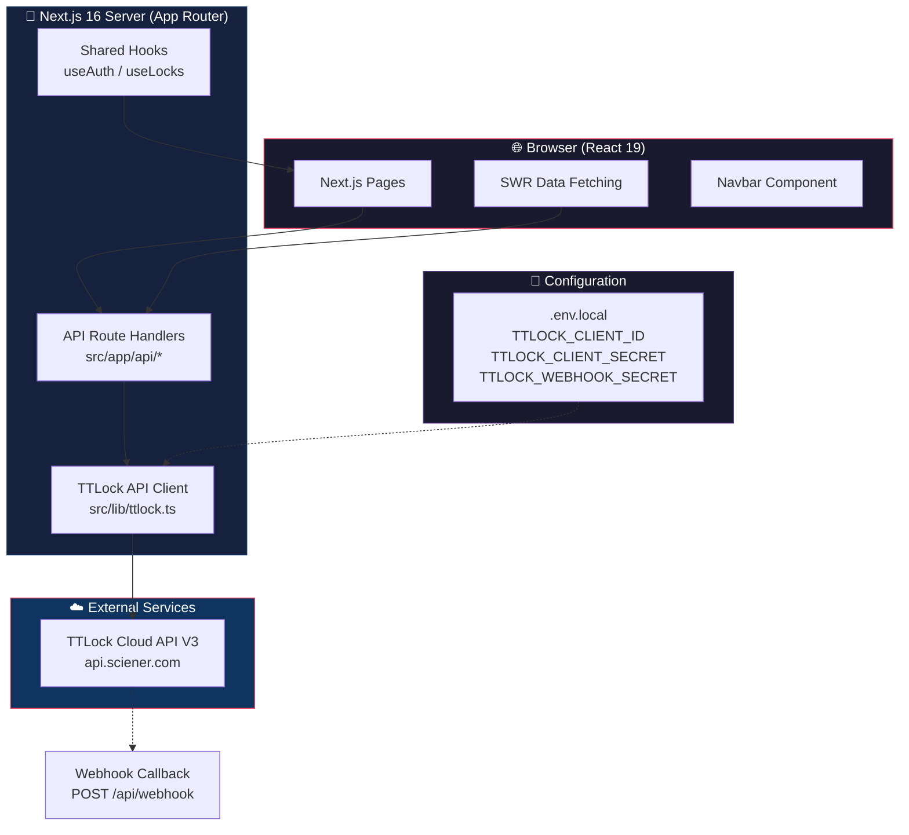
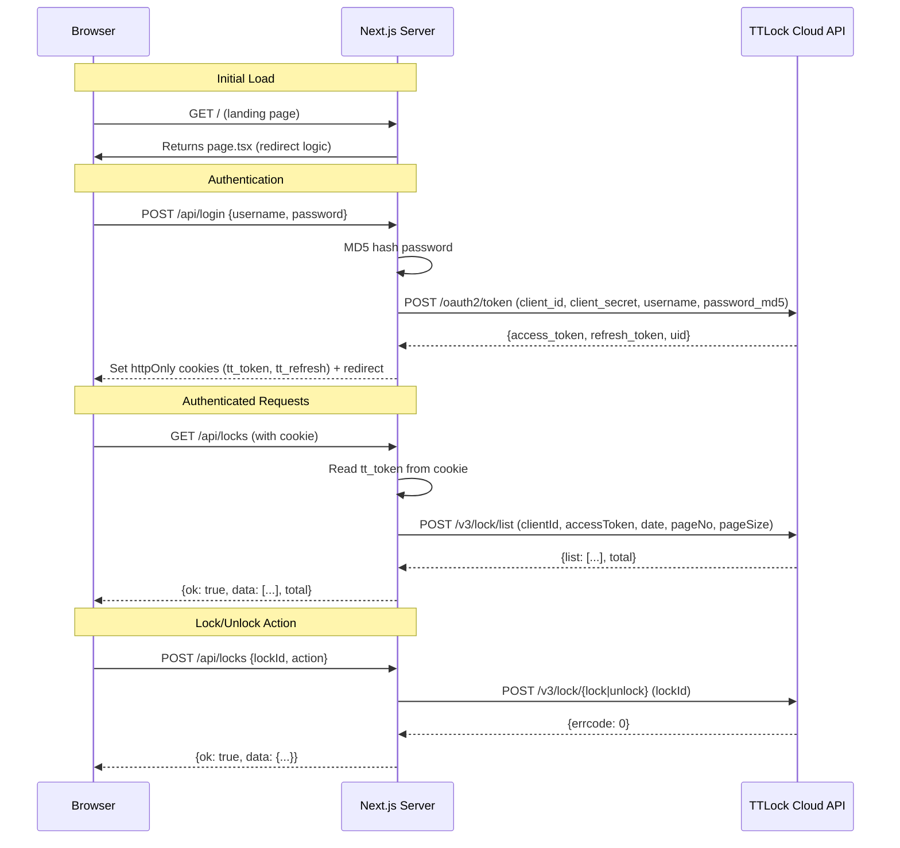

# System Architecture

## Overview

The IDGuard app is a **Next.js 16** server-side-rendered application that acts as a bridge between a browser-based UI and the **TTLock Cloud API V3**. Authentication is cookie-based, and all TTLock API calls are proxied through Next.js API route handlers to keep credentials server-side.

---

## Architecture Diagram



---

## Request Lifecycle



---

## Component Tree

```mermaid
graph TD
    Root["RootLayout<br/>layout.tsx"]
    Nav["Navbar<br/>components/Navbar.tsx"]
    LP["Landing Page<br/>page.tsx"]
    LI["Login Page<br/>login/page.tsx"]
    LF["LoginForm<br/>components/LoginForm.tsx"]
    DB["Dashboard<br/>dashboard/page.tsx"]
    LC["LockCard<br/>components/LockCard.tsx"]
    LD["Lock Detail<br/>locks/[id]/page.tsx"]
    GW["Gateways<br/>gateways/page.tsx"]
    KY["Keys<br/>keys/page.tsx"]

    Root --> Nav
    Root --> LP
    Root --> LI
    Root --> DB
    Root --> LD
    Root --> GW
    Root --> KY

    LI --> LF
    DB --> LC
    DB --> LD

    subgraph API["API Routes (src/app/api/)"]
        LOGIN["/api/login"]
        AUTH["/api/auth"]
        LOCKS["/api/locks"]
        LOCKID["/api/locks/[id]"]
        UPGRADE["/api/locks/upgrade"]
        CONFIG_L["/api/locks/config"]
        DOOR["/api/locks/door-sensor"]
        PASS["/api/passcodes"]
        IC["/api/ic-cards"]
        FP["/api/fingerprints"]
        REC["/api/records"]
        GWAPI["/api/gateways"]
        GWACT["/api/gateways/[action]"]
        GWCONF["/api/gateways/config"]
        KEYS["/api/keys"]
        WH["/api/webhook"]
    end

    LD --- PASS
    LD --- IC
    LD --- FP
    LD --- REC
    LD --- GWAPI
    LD --- CONFIG_L
    LD --- DOOR
    LD --- UPGRADE
    DB --- LOCKS
    GW --- GWAPI
    KY --- KEYS
    LC --- LOCKS
```



---

## Data Flow

```mermaid
flowchart LR
    subgraph Client_Side["Client Side"]
        SWR[SWR Fetcher] --> FETCH[fetch() with Credentials]
        FORM[Form Submit] --> FETCH
    end

    subgraph Server_Side["Server Side (Next.js Routes)"]
        CHK[Cookie Check<br/>tt_token exists?]
        COOKIE[Read tt_token]
        IMPORT[Dynamic Import<br/>ttlock function]
        TTCALL[Call TTLock API]
        RES[Return {ok, data, error}]
    end

    subgraph TTLock_API["TTLock Cloud"]
        TTL["POST /v3/{endpoint}<br/>clientId + accessToken + date + params"]
        TTR[Response JSON]
    end

    FETCH --> CHK
    CHK -- "401" --> RES
    CHK -- "ok" --> COOKIE
    COOKIE --> IMPORT
    IMPORT --> TTCALL
    TTCALL --> TTL
    TTL --> TTR
    TTR --> RES
    RES --> FETCH
    FETCH --> SWR_UPDATE["SWR Revalidation<br/>mutate()"]
    FETCH --> UI_UPDATE["State Update<br/>setState()"]

    style Client_Side fill:#1a1a2e,stroke:#e94560,color:#fff
    style Server_Side fill:#16213e,stroke:#0f3460,color:#fff
    style TTLock_API fill:#0f3460,stroke:#533483,color:#fff
```

---

## Route Dependencies

| Page | Data Dependencies | API Calls |
|---|---|---|
| `/dashboard` | Lock list, Gateway list | `GET /api/locks`, `POST /api/locks` (toggle), `GET /api/gateways` |
| `/locks/[id]` | Lock detail, Passcodes, IC cards, Fingerprints, Records, Gateways, Config, Door sensor | `GET /api/locks/[id]`, `/api/passcodes`, `/api/ic-cards`, `/api/fingerprints`, `/api/records`, `/api/gateways`, `/api/locks/config`, `/api/locks/door-sensor`, `POST /api/locks/upgrade`, `/api/passcodes` |
| `/gateways` | Gateway list | `GET /api/gateways` |
| `/keys` | Key list | `GET /api/keys` |

---

## Security Model

1. **Credentials never leave the server** — TTLock client ID/secret stored in `.env.local`, used only in `src/lib/ttlock.ts`
2. **httpOnly cookies** — `tt_token` and `tt_refresh` set server-side, inaccessible to JavaScript
3. **Every API route checks auth first** — reads `tt_token` cookie; returns 401 if missing
4. **Dynamic imports** — `await import("@/lib/ttlock")` per route handler to avoid client-side bundling of secrets

---

## Design System

IDGuard follows a **Clean • Elegant • Modern • Professional** brand identity:

### Color Palette

| Usage | Color | Hex |
|---|---|---|
| Navbar background | Deep Navy | `#183B6B` |
| Active nav / links / focus | Royal Blue | `#3B82F6` |
| Hover states / alt backgrounds | Soft Sky Blue | `#DCEEFF` |
| Page backgrounds | Pure White | `#FFFFFF` |
| Alternate sections / form bg | Warm Cream | `#F8F6F2` |
| Primary text / headings | Charcoal Gray | `#1F2937` |
| Secondary text / captions | Slate Gray | `#6B7280` |
| Card & input borders | Light Gray | `#E5E7EB` |
| Success indicators | Green | `#22C55E` |
| Warning indicators | Amber | `#F59E0B` |
| Error indicators | Red | `#EF4444` |

### Typography

- **Headings:** Poppins (weights 400–700), Deep Navy `#183B6B`
- **Body text:** Inter, Charcoal Gray `#1F2937`
- **Captions:** Slate Gray `#6B7280`

### Theme System

The app includes a runtime theme system (`src/contexts/ThemeContext.tsx`) with:
- **Dark/Light/System** mode toggle (default: light)
- **6 accent color** presets (default: Deep Navy blue)
- **Card style**: Solid or Glass
- **Border style**: Full, Subtle, or None
- **Layout**: Grid/List view, Default/Compact density
- All preferences persisted to `localStorage`
